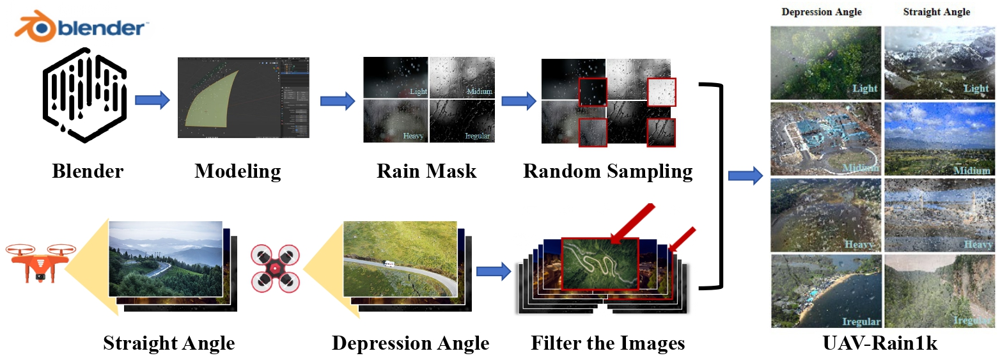

## 📖 UAV-Rain1k: A Benchmark for Raindrop Removal from UAV Aerial Imagery
> Wenhui Chang, Hongming Chen, Xin He, Xiang Chen*, Liangduo Shen*

## Abstract
Raindrops adhering to the lens of UAVs can obstruct visibility of the background scene and degrade image quality. Despite recent progress in image deraining methods and datasets, there is a lack of focus on raindrop removal from UAV aerial imagery due to the unique challenges posed by varying angles and rapid movement during drone flight. To fill the gap in this research, we first construct a new benchmark dataset for removing raindrops from UAV images, called UAV-Rain1k. In this letter, we provide a dataset generation pipeline, which includes modeling raindrop shapes using Blender, collecting background images from various UAV angles, random sampling of rain masks and etc. Based on the proposed benchmark, we further present a comprehensive evaluation of existing representative image deraining algorithms, and reveal future research opportunities worth exploring. The proposed dataset will be publicly available at https://github.com/cschenxiang/UAV-Rain1k.

---
<p align="center">
  
</p>

---

## Benchmark Dataset
Coming Soon!

## Performance Evaluation

The PSNR and SSIM results are computed by using this [Python Code](https://github.com/cschenxiang/UAV-Rain1k/blob/main/score.py), based on Y channel of YCbCr space.

## Visual Deraining Results

Coming Soon!

## Citation
If you find this project useful in your research, please consider citing:
```
@article{UAV-Rain1k,
    title={UAV-Rain1k: A Benchmark for Raindrop Removal from UAV Aerial Imagery},
    author={Chang, Wenhui and Chen, Hongming and He, Xin and Chen, Xiang and Shen, Liangduo},
    journal={arXiv preprint arXiv:},
    year={2024}
}
```

## Disclaimer
Please only use the dataset for research purposes.

## Contact
If you have any questions, please feel free to reach me out at chenxiang@njust.edu.cn
