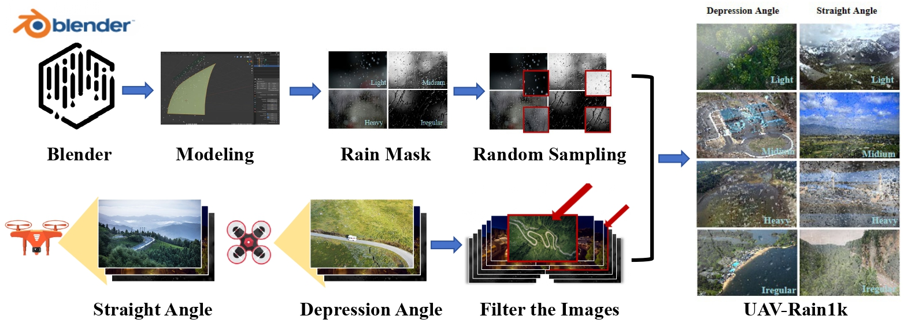

# <p align=center> :fire: `UAV-Rain1k: A Benchmark for Raindrop Removal from UAV Aerial Imagery`</p>

> Wenhui Chang, Hongming Chen, Xin He, Xiang Chen*, Liangduo Shen*

>Shenyang Aerospace University, Naval Aviation University, Nanjing University of Science and Technology, Zhejiang Ocean University

---
### Dataset

(The datasets are hosted on both Google Drive and BaiduPan)
| Dataset | Link | Number | Description|
| :----- | :--: | :----: | :---- | 
| UHD-LL_down| [Google Drive](https://drive.google.com/file/d/1KnsimKvQK38qDOrF4cPLFC2-tNIy5vZ8/view?usp=sharing) / [BaiduPan (key: 1234)](https://pan.baidu.com/s/17v96dX_ity_HkCxj-8pyCA?pwd=1234) | 2,150 | A total of 2,000 pairs for training and 150 pairs for testing. Resolution: 960 × 540|

## Benchmark Dataset
https://pan.baidu.com/s/1E9b2sW_BEclQUROg8xKdkg?pwd=du3z (du3z)

## Performance Evaluation

The PSNR and SSIM results are computed by using this [Python Code](https://github.com/cschenxiang/UAV-Rain1k/blob/main/score.py), based on Y channel of YCbCr space.

## Visual Deraining Results

RCDNet: https://pan.baidu.com/s/1ZHZqQVbKCnCuIh6atvS0zQ?pwd=n4gl (n4gl)

SPDNet: https://pan.baidu.com/s/1yQdLAnUVexOKuYLYtkFLgg?pwd=hca4 (hca4)

Restormer: https://pan.baidu.com/s/1j7X2NpfEPXYMCyZ1v5pbFw?pwd=si1w (si1w)

IDT: https://pan.baidu.com/s/1sVcMX35YCQEvWDhoYaL3Cg?pwd=onx0 (onx0)

DRSformer: https://pan.baidu.com/s/1kHGefiug6dJ5I0Ia8Kv96Q?pwd=hyg6 (hyg6)

## Citation
If you find this project useful in your research, please consider citing:
```
@article{UAV-Rain1k,
    title={UAV-Rain1k: A Benchmark for Raindrop Removal from UAV Aerial Imagery},
    author={Chang, Wenhui and Chen, Hongming and He, Xin and Chen, Xiang and Shen, Liangduo},
    journal={arXiv preprint arXiv:},
    year={2024}
}
```

## Disclaimer
Please only use the dataset for research purposes.

## Contact
If you have any questions, please feel free to reach me out at chenxiang@njust.edu.cn
